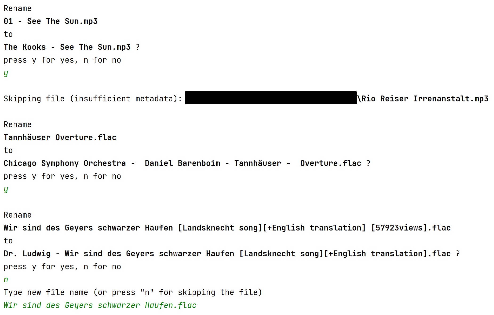

# audio-rename
This program renames your files by picking title and artist from its metadata. 

_Example:_ `01 - Piano & I.mp3` is being renamed to `Alicia Keys - Piano & I.mp3`

## Motivation 
While people have a growing music library, oftentimes the file names are messy and inconsistent. 

This program cleans up your files and you get a homogenous file name structure.

## Supported formats
- MP3/MP2/MP1 (ID3 v1, v1.1, v2.2, v2.3+)
- Wave/RIFF
- OGG
- OPUS
- FLAC
- WMA
- MP4/M4A/M4B/M4R/M4V/ALAC/AAX/AAXC
- AIFF/AIFF-C

see https://github.com/devsnd/tinytag#Features


## Procedure
The program scans a directory for audio files.

__interactive version:__
For each file, when metadata is present, the program proposes its renaming which the user can confirm or not.
The proposed file name has the pattern `artist - title.mp3` (or other audio file extensions).
In case you deny the proposed renaiming (for example when metadata is empty and the proposed file name is bad), the program asks you to rename it manually.
You then enter a new file name manually __or__ decide to leave its present file name.
So for each file, you are in control if and how it should be renamed.

__non-interactive version:__
The program goes through the files and renames them without asking. 
Here it is recommendend to be conservative and work through smaller amounts of files.

<!--  -->


## Get started

1. Download the file
2. Open it in your Python IDE (I recommend [PyCharm](https://www.jetbrains.com/pycharm/))
3. Paste the target path into the variable quotes of `main_folder = r"C:\path\to\your\audio\folder"`
4. Run  

Setting up a test folder for a first try is recommended as the file names will be overwritten.

## Development setup

Required external libraries are
- TinyTag: https://github.com/devsnd/tinytag

```sh
pip install TinyTag
```

## Meta

Author: Jonas Dossmann

Distributed under the GPL-3.0 license.

[https://github.com/dossma/](https://github.com/dossma/)

<!-- Markdown link & img dfn's -->
[npm-image]: https://img.shields.io/npm/v/datadog-metrics.svg?style=flat-square
[npm-url]: https://npmjs.org/package/datadog-metrics
[npm-downloads]: https://img.shields.io/npm/dm/datadog-metrics.svg?style=flat-square
[travis-image]: https://img.shields.io/travis/dossma/node-datadog-metrics/master.svg?style=flat-square
[travis-url]: https://travis-ci.org/dossma/node-datadog-metrics
[wiki]: https://github.com/dossma/ebook-file-renaming/wiki
